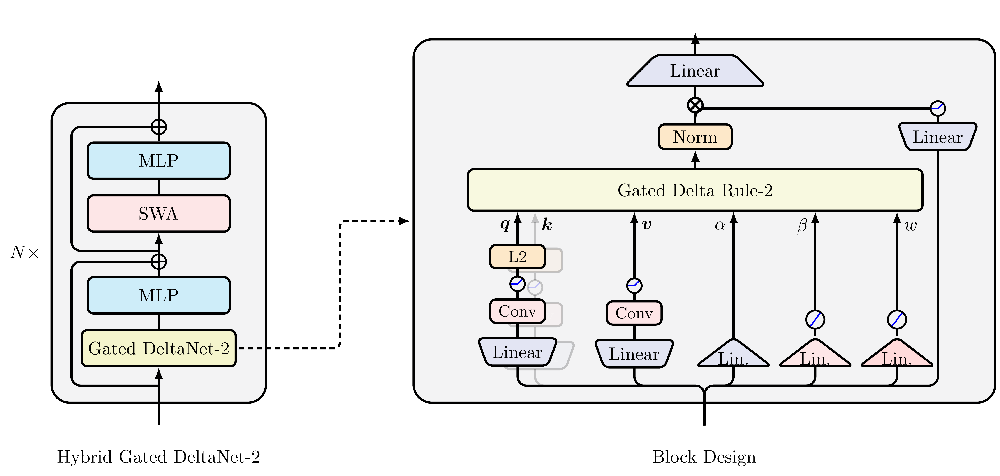

# 🔺 Gated DeltaNet-2: Decoupling Erase and Write in Linear Attention

Official PyTorch implementation of [**Gated DeltaNet-2: Decoupling Erase and Write in Linear Attention**](https://arxiv.org/abs/2605.22791).

[](https://github.com/NVlabs/GatedDeltaNet-2/stargazers)

[Ali Hatamizadeh](https://ahatamiz.github.io),
[Yejin Choi](https://homes.cs.washington.edu/~yejin/), and
[Jan Kautz](https://jankautz.com/).


## 🌟 Why Gated DeltaNet-2?

Linear attention compresses an unbounded KV cache into a fixed-size recurrent state. The hard part is not just *what to forget*, but *how to edit* this compressed memory without scrambling existing associations. Prior delta-rule models (Gated DeltaNet, Kimi Delta Attention) tie *erasing* and *writing* to a single scalar gate — even though they act on different axes of the state.

**Gated DeltaNet-2** decouples these two roles:

- ✂️ **Channel-wise Erase Gate `b_t`** — selects which *key-side* coordinates of the decayed state are read and removed
- ✍️ **Channel-wise Write Gate `w_t`** — selects which *value-side* coordinates of the new content are committed
- 🌀 **Channel-wise Decay** — inherited from KDA for fine-grained global forgetting
- 🔁 **Strict Generalization** — recovers KDA when both gates collapse to the same scalar, and Gated DeltaNet when the decay also collapses
- ⚡ **Hardware-efficient Training** — fast-weight WY chunkwise algorithm with gate-aware backward, fused in Triton


<p align="center">
  
</p>


## 📐 The Gated Delta Rule-2

Given an erase gate `b_t ∈ [0,1]^{d_k}`, a write gate `w_t ∈ [0,1]^{d_v}`, and channel-wise decay `D_t = Diag(α_t)`, the recurrent state evolves as:

```
S_t = (I − k_t (b_t ⊙ k_t)ᵀ) D_t S_{t−1}  +  k_t (w_t ⊙ v_t)ᵀ
```

Compared with KDA, the right factor of the rank-one erase becomes channel-selective on the *key* axis, and the write term becomes channel-selective on the *value* axis. The two decisions no longer share a single scalar.


## 📊 Results

We train all models at **1.3B parameters on 100B tokens of FineWeb-Edu**, matched in recurrent state size, and compare against Mamba-2, Gated DeltaNet, KDA, and Mamba-3 (SISO and MIMO).

### Language Modeling and Commonsense Reasoning

Gated DeltaNet-2 achieves the best average across both **recurrent-only** and **hybrid** settings:

| Model | Wiki ppl ↓ | LMB ppl ↓ | LMB acc ↑ | Avg. acc ↑ |
|---|---|---|---|---|
| **Recurrent** | | | | |
| Mamba-2 | 16.79 | 12.38 | 45.24 | 51.82 |
| Gated DeltaNet | 16.40 | 11.89 | 49.62 | 52.07 |
| KDA | 16.81 | 11.68 | 48.13 | 52.28 |
| Mamba-3 (MIMO) | 16.45 | 11.66 | 47.82 | 52.39 |
| **Gated DeltaNet-2** | **15.90** | **11.41** | 48.09 | **53.11** |
| **Hybrid (+ SWA)** | | | | |
| Transformer | 19.22 | 13.72 | 48.32 | 50.86 |
| Gated DeltaNet | 16.00 | 10.82 | 48.71 | 52.25 |
| KDA | 16.01 | 10.66 | 49.21 | 52.68 |
| Mamba-3 (MIMO) | 15.81 | 10.92 | 49.82 | 52.72 |
| **Gated DeltaNet-2** | **15.62** | **10.43** | **50.90** | **53.97** |

### Long-context Retrieval (RULER)

Gated DeltaNet-2 is strongest where memory editing matters most — particularly the interference-heavy multi-key needle-in-a-haystack settings:

| Model | S-NIAH-2 @4K | S-NIAH-3 @2K | MK-NIAH-1 @4K |
|---|---|---|---|
| **Recurrent** | | | |
| Gated DeltaNet | 87.2 | 54.2 | 27.8 |
| KDA | 89.0 | 63.2 | 28.0 |
| Mamba-3 (MIMO) | 64.2 | 72.4 | 18.0 |
| **Gated DeltaNet-2** | **93.0** | **89.8** | **37.8** |
| **Hybrid** | | | |
| Gated DeltaNet | 57.3 | 91.2 | 44.8 |
| KDA | 56.0 | 93.4 | 40.4 |
| Mamba-3 (MIMO) | 53.0 | 98.4 | 46.6 |
| **Gated DeltaNet-2** | **57.9** | **99.0** | **48.0** |

### Real-world Retrieval

Across SWDE, SQuAD, FDA, TriviaQA, NQ, and DROP, Gated DeltaNet-2 leads the recurrent and hybrid frontier:

| Setting | Mamba-2 | GDN | KDA | Mamba-3 (MIMO) | **GDN-2** |
|---|---|---|---|---|---|
| Recurrent avg. | 26.84 | 28.09 | 28.67 | 28.35 | **29.88** |
| Hybrid avg. | 39.74 | 39.11 | 40.14 | 40.11 | **42.28** |

### Throughput

Gated DeltaNet-2 retains near-flat scaling with sequence length on a single H100 (training, hybrid 1.3B), with only a small constant overhead over KDA for the added channel-wise gates.


## 🔧 What's New in the Update Rule

| Method | Decay | Erase | Write |
|---|---|---|---|
| Mamba-2 | scalar | — | scalar |
| Gated DeltaNet | scalar | scalar `β_t` | scalar `β_t` |
| KDA | **channel-wise** | scalar `β_t` | scalar `β_t` |
| **Gated DeltaNet-2** | **channel-wise** | **channel-wise `b_t`** | **channel-wise `w_t`** |

Ablations confirm both gates contribute, with the **erase gate `b_t` accounting for most of the gain** — consistent with its role in selectively protecting or revising key-side associations in the recurrent state.


## 📢 Latest Updates

- `05/21/2026`: 🔥 **Code Release**: Train your own Gated DeltaNet-2 on FineWeb-Edu
- Watch this space for more exciting updates!


## 🚀 Getting Started

### Training Your Model

Launch your training with our streamlined command:

```bash
python ../pretrain.py \
--train_data_dir ${TRAIN_DATA} \
--val_data_dir ${VALIDATION_DATA} \
--output_root ${SAVE_DIR} \
--exp_name ${NAME} \
--model_name ${MODEL} \
--train_config ${CONFIG} \
--eval_iters ${EVAL_ITERS} \
--learning_rate ${LR} \
--micro_batch_size ${MICRO_BATCH_SIZE}
```

💡 **Pro Tip**: Add `--interactive_job --debug` for interactive debugging sessions!

### Default Recipe

We train 1.3B-parameter models on 100B tokens of FineWeb-Edu with:

- AdamW, peak LR `4e-4`, weight decay `0.1`, gradient clip `1.0`
- Cosine schedule with 1B-token warmup
- Global batch size `0.5M` tokens, sequence length `4K`
- Hybrid models use a `2K` sliding-window attention size
- 16 heads, `d_k = d_v = 128`, matched recurrent state size against Mamba-2/3 baselines


## 📜 License

Copyright © 2026, NVIDIA Corporation. All rights reserved.

Licensed under the NVIDIA Source Code License-NC. See [LICENSE](LICENSE) for details.


## 🙏 Acknowledgements

Built on the shoulders of giants:
- [Gated DeltaNet](https://github.com/NVlabs/GatedDeltaNet)
- [Kimi Delta Attention](https://arxiv.org/abs/2510.26692)
- [Flash Linear Attention](https://github.com/fla-org/flash-linear-attention)
- [Samba](https://github.com/microsoft/Samba)
- [LiTGPT](https://github.com/Lightning-AI/litgpt)


## 📖 Citation

If you find this work useful, please consider citing:

```bibtex
@article{hatamizadeh2026gated,
  title={Gated DeltaNet-2: Decoupling Erase and Write in Linear Attention},
  author={Hatamizadeh, Ali and Choi, Yejin and Kautz, Jan},
  journal={arXiv preprint arXiv:2605.22791},
  year={2026}
}
```


## ⭐ Support Us

If you find this work useful, please consider:
- Starring the repository
- Citing our paper
- Contributing to the codebase

Join us in pushing the boundaries of linear attention! 🚀


## Star History

[](https://github.com/NVlabs/GatedDeltaNet-2/stargazers)


[](https://star-history.com/#NVlabs/GatedDeltaNet-2&Date)
